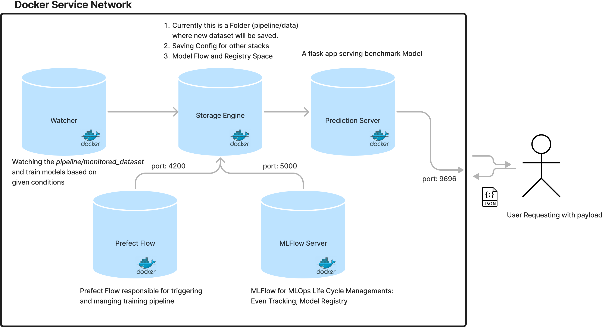

# Continues Training of Mnist Digits

## Description
This repo has been created to serve the objectives:
1. Image Dataset: Create Dataset from the csv and store them in directories under `dataset`. Directory Structure will look like as shown below and each directory will contain  `~1000 images`
2. Classification MLOps Pipeline: The pipeline should automatically retrain a new classification model as soon as there are `significant changes` in dataset. `significant changes` when the changes in files of a label is more than 200.

## Flow/Diagram



## Improvements
- [ ] Async Data sources process
- [ ] Integration with AWS Cloud
- [ ] Kubernatives
- [ ] Watcher with timer: 5 min
- [ ] CI/CD Pipeline, TerraForm, pre-commit hooks, pylint
- [ ] Better Code Architecture Refractor Code 
- [ ] Github Actions Integration and Issues Templates
- [ ] Model Serving in different hardware: raspberry pi, Android, javascript, onnx, tflite
- [ ] Documentations


## Getting Started

### Dependencies

* Docker version 20.10.17, build 100c701
* docker-compose version 1.29.2, build 5becea4c
* Distributor ID: Ubuntu ,Description: Ubuntu 22.04.1 LTS ,Release: 22.04 , Codename: jammy


### Installing

`pipeline/`: all the docker services is inside this folder

`pipeline/data`: represent volumes used between containers

* Run the latest version of the code with Docker and Docker Compose: 

  `docker-compose up -d`


* Folder Structures
```
.
├── data # volumes that is shared among all services
│   ├── dataset # dataset for initial base model 
│   ├── mlflow # mlruns and .db file, mlflow tracking uri 
│   ├── monitored_dataset # watching this repo to track any changes in dataset
│   ├── prefect # for prefect flow uri
│   ├── saved-model 
│   └── state # to manage state of docker-services
├── docker-compose.yml 
├── mlflow/ # folder to build mlflow-server images 
├── prefect/ # folder to build prefect-server images 
├── README.md
├── test.py # a python script to trigger webserver and get output
├── watcher/ # folder to build watcher images 
└── webserver/ # folder to build prediction server images 

84 directories, 168 files
```

### Executing program
  By default, the stack exposes the following ports:

    <Ports>: <Service>
    5000: MLFlow Webserver 
    4200: Prefect Web Server
    9696: Prediction Server

## Authors
* [Saurav Solanki](https://github.com/sauravsolanki)

## Version History
* 0.1 : Initial Release (_**Currently**_)

## License

This project is licensed under the Saurav Solanki License - see the LICENSE.md file for details

## Acknowledgments
* [mlflow](https://github.com/mlflow/mlflow)
* [tensorflow](https://github.com/tensorflow/tensorflow)
* [prefect](https://github.com/PrefectHQ/prefect)
* [docker](https://github.com/docker)
